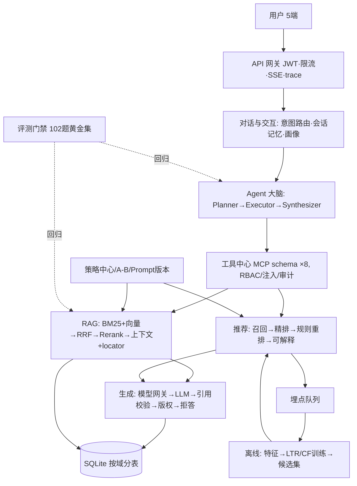

# 问小汉 · 架构图集

> 配套文档：[架构说明](architecture.md)（模块/替换点/非功能）· 服务现在 http://127.0.0.1:8300 运行。
> 本文档含 5 张图：分层架构 / 服务拓扑与数据所有权 / 问答链路时序 / 推荐闭环 / Mermaid 版。

---

## 1. 整体分层架构

```
┌────────────────────────────────────────────────────────────────────────────┐
│ 终端层     Web/H5(/web 原生JS) · 电纸书 · 小程序 · 音箱   —— 统一 OpenAPI 契约 │
├────────────────────────────────────────────────────────────────────────────┤
│ 接入层     FastAPI 网关中间件: JWT 鉴权(access+refresh) · IP黑名单 · 滑动限流  │
│            · trace_id 贯穿 · 请求指标 · CORS · LLM 流式 SSE(禁缓冲)          │
├────────────────────────────────────────────────────────────────────────────┤
│ 对话与交互  意图路由(规则→弱模型JSON兜底, 多轮指代改写) · 会话记忆(30min TTL)   │
│            用户画像(偏好分布/recent_books → prompt注入)                      │
├────────────────────────────────────────────────────────────────────────────┤
│ Agent 大脑  Planner(意图→工具计划 DAG) ─▶ Executor(无依赖并行+超时分层)      │
│            ─▶ Synthesizer(文本/卡片/对比/订单) · 拒答改写重检 · 追问建议      │
├────────────────────────────────────────────────────────────────────────────┤
│ 工具中心    8 工具(MCP schema): book_search · book_qa · recommend_books    │
│            compare_books · my_library · user_profile · purchase_init×confirm│
│            注册表=唯一通道: RBAC → 参数注入扫描 → 契约校验 → 审计 → 降级      │
├────────────────────────────────────────────────────────────────────────────┤
│ RAG 引擎    BM25(FTS5, 标题词×2+短语通道) ⊕ 向量(hash/API) → RRF融合        │
│             → Rerank(本地词面/API可切) → 上下文(父块扩展·预算·去重·locator)   │
├────────────────────────────────────────────────────────────────────────────┤
│ 推荐引擎    召回(编辑位/CF/内容/热门/分类/会话实时) → 精排(LTR权重|规则权重)   │
│             → 规则重排(曝光去重·类目多样性·MMR·优先位·ε-greedy探索位)         │
│             → 可解释(reasons/通道/打分明细) → 曝光埋点(带A/B variant)        │
├────────────────────────────────────────────────────────────────────────────┤
│ 生成引擎    模型网关: strong/weak 分级 · 多模型降级链 · 配额/成本计量 · 审计   │
│             LLM流式 → [n]引用交叉验证(词元∨二元组∨8gram∨答案级) → 版权护栏    │
│             → 主题锚词守卫 → 拒答(宁拒不编造) · 精确缓存 + 语义缓存           │
├────────────────────────────────────────────────────────────────────────────┤
│ 运营策略    策略中心(30+键, 运行期生效) · A/B实验(分桶/回流/晋升) · Campaign  │
│            · 优先图书 · Prompt版本管理(默认v0/DB版本化)                      │
├────────────────────────────────────────────────────────────────────────────┤
│ 数据层      SQLite(WAL) 按域分表 —— 即数据所有权边界:                        │
│  books_/chunks_/chunks_fts │ users_/chat_/memory_/user_library              │
│  orders_ │ ops_strategies/campaigns/experiments/prompts                    │
│  event_queue/events_/features_/rec_models/rec_candidates                    │
│  mh_calls/mh_quota_daily │ eval_cases/eval_runs │ audit_logs/injection_hits  │
├────────────────────────────────────────────────────────────────────────────┤
│ 离线链路   埋点队列(原子认领+租约回收, 多实例安全) → 事件明细                │
│             → 特征平台(增量消费+全量对账) → LTR逻辑回归+item-item CF训练     │
│             → 候选集预计算 → 在线打分(特征同源, 防穿越)                      │
├────────────────────────────────────────────────────────────────────────────┤
│ 基础设施   JSON结构化日志+trace · Prometheus指标(/metrics) · 内置调度器      │
│            (SCHEDULER_ENABLED=1) · Dockerfile+compose · CI(compileall+      │
│            pytest+三套门禁) · 评测黄金集102题(问题-答案-引用位置)             │
└────────────────────────────────────────────────────────────────────────────┘
```

---

## 2. 服务/模块拓扑与数据所有权（对应开发计划 §3.5）

```
                    ┌──────────────────────────────┐
                    │  Web 前端 / MCP 客户端 / 多端  │
                    └──────────────┬───────────────┘
                                   │ HTTP / SSE
                    ┌──────────────▼───────────────┐
                    │ API 网关层 (server/)          │  JWT · 限流 · 黑名单 · trace
                    └──────┬──────────────┬────────┘
          （以下各域=未来微服务边界，跨域仅经 API/函数边界，禁止跨库直连）
   ┌───────────────────────▼──────────────▼──────────────────────────────┐
   │ 对话交互服务 (conversation/)           │ 拥有: 会话消息/短期记忆/画像  │
   │ Agent 编排服务 (agent/)                │ 无状态                      │
   │ 工具中心 (tools/)                      │ 无状态(调用下游)            │
   │ RAG 检索服务 (rag/+pipeline/)          │ 拥有: 索引与检索逻辑        │
   │ 推荐服务 (recommend/)                  │ 拥有: 特征拼接与打分        │
   │ 生成服务 (generation/ + modelhub/)     │ 无状态(模型网关隔离)        │
   │ 运营策略中心 (ops/)                    │ 拥有: 策略配置/实验/Prompt  │
   │ 离线计算 (events/+offline/)            │ 拥有: 特征与模型           │
   └──────────────────────────────────────────────────────────────────────┘
          ▲            ▲            ▲                ▲
   数据域(按表前缀划分): 图书域 用户域 订单域 运营域 埋点/特征域 模型治理域 评测域 审计域
```

**数据所有权速查**：

| 域 | 表前缀 | 唯一写入方 | 其余访问 |
|---|---|---|---|
| 图书 | books/chapters/chunks | pipeline（入库/重建） | 只读（检索/阅读/推荐） |
| 用户 | users/chat/memory/library | server + conversation（会话） | 只读或被依赖 |
| 订单 | orders | tools/purchase（二次确认+风控） | 只读（审计） |
| 运营 | ops_* | ops/ | 运行期只读 |
| 埋点/特征 | event*/features*/rec_* | events/ + offline/ | 推荐/评测只读 |
| 模型治理 | mh_* | modelhub | 成本看板只读 |
| 评测 | eval_* | evals/ | 管理后台只读 |
| 审计 | audit_* | tools/registry + security | 管理后台只读 |

---

## 3. 问答链路时序（RAG 主链路）

```
用户 ─▶ POST /api/chat (SSE)
   │
   ▼ 安全闸  injection.check_user_message（命中→拒绝+留痕）
   ▼ 意图    规则路由 → 弱模型 JSON 兜底；《书名》抽取；指代+会话记忆改写
   ▼ 计划    Planner: 单工具直连（qa→book_qa）
   ▼ 检索    retriever.retrieve_multi：
                查询改写(LLM, 失败回退) → 原查询+改写查询双路
                BM25(FTS5 短语通道, 标题词×2) ⊕ 向量(hash/API 余弦)
                RRF 融合 → 资料区注入扫描(不可信剔除) → Rerank(词面/API)
   ▼ 上下文  父块扩展(同章邻块) · 去重/每书≤3 · token预算 · locator(卷/章/页)
   ▼ 生成   模型网关(strong/weak 分级→降级链→配额) → LLM 流式 (低温0.3)
               逐句 [n] 引用 → 交叉验证(词元∨8gram∨二元组∨答案级)
               版权护栏(连续引用节选) → 主题锚词守卫 → 无据=拒答
   ▼ 综合    Synthesizer QA透传 + 追问建议 + 成本/tokens
   ▼ 记忆    短期: last_book/last_intent(TTL) · 长期: 用户画像(事件沉淀)
   ▼ 落库    消息持久化 + chat_message 埋点 → 消费线程 → 特征
   ▼ 回包    SSE: intent→plan→tool→retrieval→context→delta…→citations→done
```

## 4. 推荐闭环（在线打分 + 离线闭环）

```
 离线侧                                                    在线侧
 埋点(用户/匿名)                         ┌─── 用户请求 /api/recommend ───┐
   ▼ event_queue(原子认领+租约)           │ 召回5路: 编辑位/CF/内容/热门/  │
   ▼ Consumer(增量特征写入)               │   分类/会话实时(last_book)     │
   ▼ 特征平台全量对账(每小时, 调度器)       │ 精排: 特征拼接 × LTR权重|规则   │
   ▼ 离线训练: LTR逻辑回归 + item-item CF │ A/B分桶 rec_rank_v1(A规则/B训练)│
   ▼ 候选集预计算(每用户Top200)           │ 规则重排: 曝光去重·类目多样性·  │
   ▼ 模型库 rec_models(版本+指标)         │   MMR·优先位·ε-greedy探索位    │
                                          │ 可解释: reasons/通道/打分明细   │
                                          └──────┬───────▲───────────────┘
 用户反馈(点击/阅读/收藏/购买) ─▶ 埋点 ─▶ 效果回流(A/B指标) ─▶ 赢家晋升▶策略中心
```

## 5. Mermaid 版（GitHub/Mermaid 渲染器可直接看图）



> 渲染图：`images/architecture.png`（脚本 `scripts/render_arch_diagram.py` 可重生成）。
